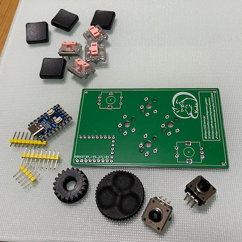
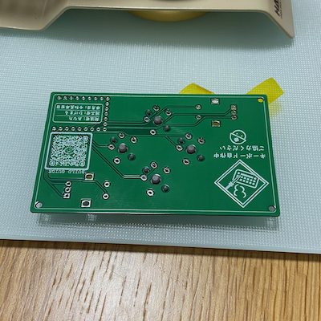
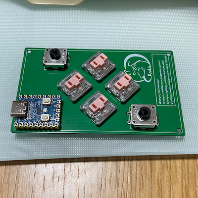
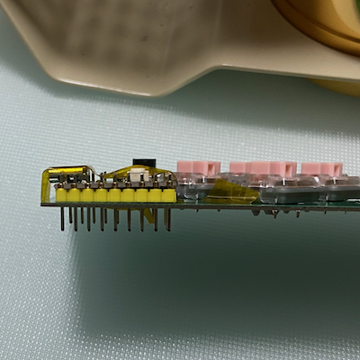
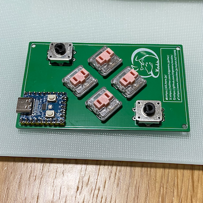
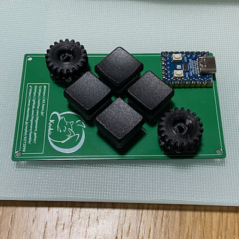

# ビルドガイド

Kewbie Card のビルドガイドです

## 必要なパーツ

|パーツ|数|説明|
|---|--|--|
|PCB|1|1.6mm 厚|
|RP2040-Zero|1|https://www.waveshare.com/wiki/RP2040-Zero|
|Key swtiches|4|Cherry MX Compatible or Kailh Choc V1|
|Rotaly encoders|2|EC12　Compatible|
|Knob|2|For EC12 Compatible, 6mm D Shaft|

## 始めに

他のキーボード作者さんが、丁寧なビルドガイドを作成されています。読むだけで学びになりますので、いくつか事前に読まれることをお勧めします。

## MCU動作チェック

「RP2040-Zero」というマイコンを使っています。はんだづけをする前に、まず、ファームウェアを書き込んで、不良品でないことを確認します。

1. USB ケーブルで PC に接続する

   - USB マスストレージとしてマウントされます
   - マウントされない場合は、接続した状態で、RP2040-Zero 上の「BOOT」を押しながら「RESET」を押してみてください

2. ファームウェアを書き込む

   - [ファームウェアをダウンロード](../firmware/)し、1. でマウントされた USB メディアにドラッグ & ドロップします

3. キーボードとして認識されているかどうか確かめます

   1. ウェブブラウザ [Google Chrome](https://www.google.com/intl/ja_jp/chrome/) で、[Vial のウェブサイト](https://get.vial.today/)にアクセスします

     - WebHID 対応ブラウザでアクセスする必要があります

   2. 「Start Vial Web」をクリック→「Start Vial」をクリック
   3. HIDデバイスへの接続ダイアログが表示されるので「Kewbie」を選択して接続
   4. デフォルトのキーマップが表示されたら成功です

## 組み立て

### 始めに

すべてのパーツです。古い基板だと、エンコーダ用のノブは、直径の大きいものはキーボードと干渉して回りません。

Cherry MX もしくは Choc V1/V2 のキースイッチを並べて、裏側からはんだ付けしてください。マスキングテープで固定して作業するとやりやすくなります。私はカプトンテープ（絶縁耐熱）を使っています。キースイッチが傾かないよう注意してください。

他のパーツも同様に。

