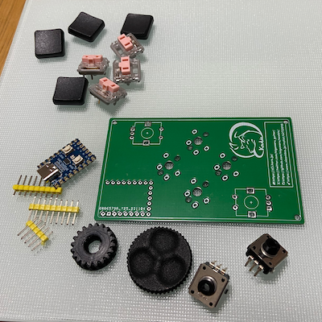
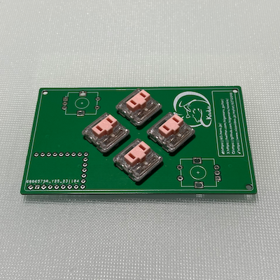
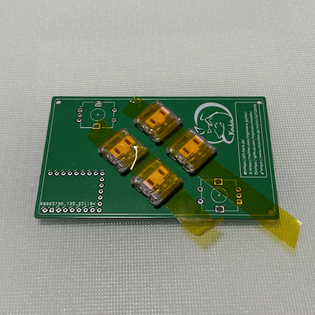
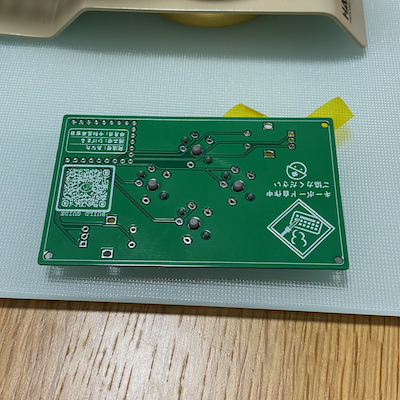
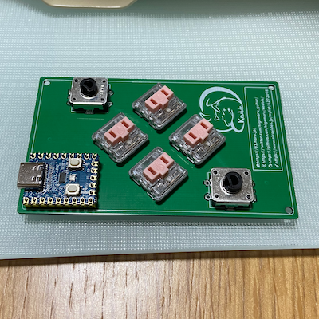
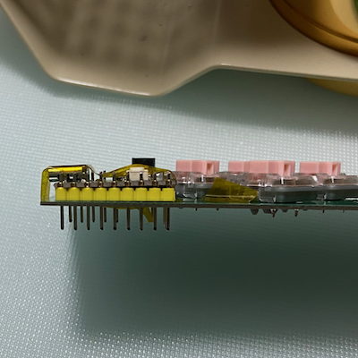
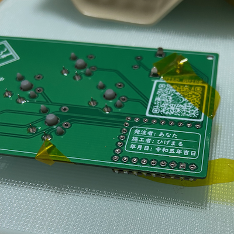
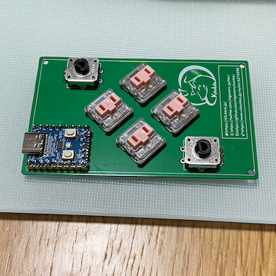
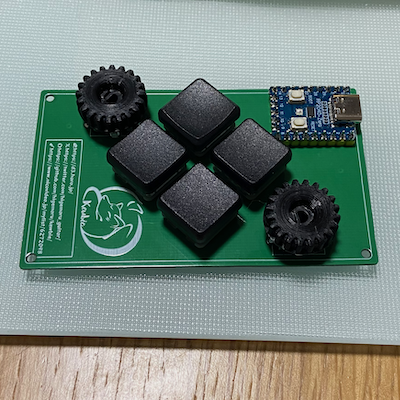

# Build Guide

This is the building guide for Kewbie Card.

## Required Parts

|Name|Count|Remarks|
|---|--|--|
|PCB|1|1.6mm thick|
|RP2040-Zero|1|https://www.waveshare.com/wiki/RP2040-Zero|
|Key swtiches|4|Cherry MX Compatible or Kailh Choc V1|
|Rotaly encoders|2|EC12　Compatible|
|Knob|2|For EC12 Compatible, 6mm D Shaft|

## Introduction

Other keyboard authors have provided great build guides. I recommend that you read some of them beforehand, so you will learn a lot .

## Check the MCU

"Kewbie" uses a microcontroller "RP2040-Zero". Before soldering, first you should write the firmware to make sure it is not defective.

## Assembly

On older boards, the knobs for encoders with larger diameters will not turn (because they interfere with the keyboard).

Line up the Cherry MX or Choc V1/V2 key switches and solder from the back side.
It is easier to work with masking tape to hold it in place.I use Kapton tape (insulation heat resistant).
Be careful not to tilt the key switch.

same for other parts.

