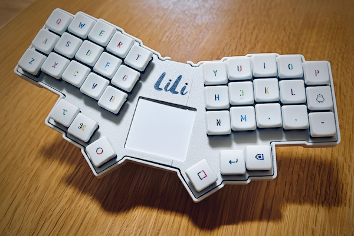
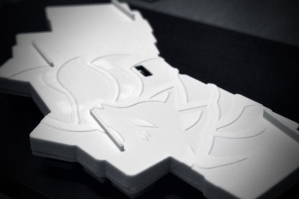
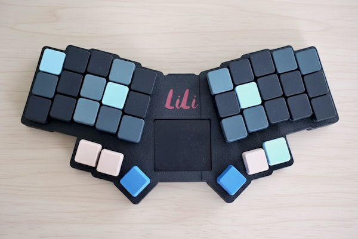
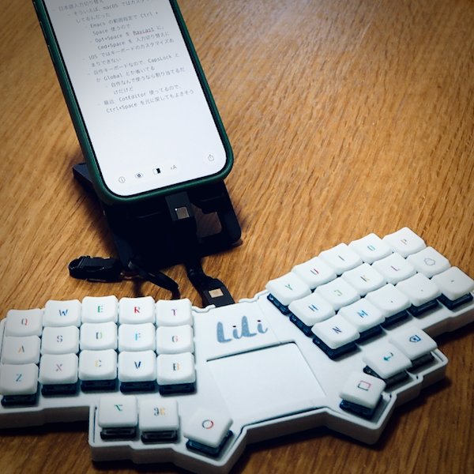

# Kewbie36tp LiLi

36Key keyboard designed for the SONSHI style (placed on top of a MacBook).

- Low profile and narrow pitch keys (18 x 17mm).
  -  Designed to use 17.5(w)x16.5(d)mm or smaller keycaps.
- The touchpad is just functional. It's for emergencies.

# Required Parts

|Name|Count|Remarks|
|---|--|--|
|PCB|1|1.6mm thick [[gerber](gerber/jlcpcb)]|
|Top Cover|1|[[stl](stl/top_cover.stl)]|
|Bottom Case|1|[[stl](stl/bottom_case.stl)]|
|TouchPad Case|1|[[stl](stl/pedestal.stl)]|
|RP2040-Zero|1|https://www.waveshare.com/wiki/RP2040-Zero|
|Diodes|36|SMD style (SOD123/1N4148W)|
|Key sockets|36| Kailh Choc v1/v2 Compatible|
|Key swtiches|36|Kailh Choc v1/v2 Compatible|
|Keycaps|36|Kailh Choc v1/v2 Compatible|
|Touch Pad|1|[TPS43-201A-S](https://www.marutsu.co.jp/pc/i/25650684/)|
|FPC Connector|1|[kinghelm KH-FG0.5-H2.0-6PIN](https://www.lcsc.com/product-detail/C709363.html)|
|Flat cable|1|0.5mm 6pin ribbon cable|
|Bolt M2 4mm|12||
|Nut M2|4||
|Spacer M2 6mm|4||

## Build Guide

* [Kewbie36 build guide](guide)

## Bootloader / Customize

* **Physical reset button**: Briefly press the button on the PCB - some may have pads you must short instead
  * To enter USB mass storage mode, press the RESET button with holding down the BOOT button, and write firmware by drag & drop.

* [Firmware](firmware)
  * [Vial](https://vial.today/)
* [Source code](https://github.com/higemaru/vial-qmk/tree/vial/keyboards/kewbie/kewbie36tp)
