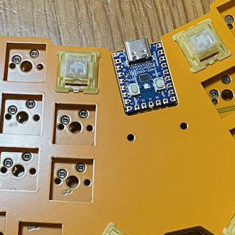

# ビルドガイド

Kewbie46 ビルドガイドです

## 必要なパーツ

|パーツ|数|説明|
|---|--|--|
|PCB|1|1.6mm 厚 [[gerber](../gerber/kewbie46/jlcpcb)]|
|トップレート|1|1.6mm 厚 [[gerber](../gerber/kewbie46/jlcpcb)]|
|ボトムプレート|1|1.6mm 厚 [[gerber](../gerber/kewbie46/jlcpcb)]|
|MCU カバー|1|[[gerber](../gerber/kewbie46/jlcpcb)]|
|RP2040-Zero|1|https://www.waveshare.com/wiki/RP2040-Zero|
|ダイオード|46|SMD style (SOD123/1N4148W)|
|キーソケット|46| Cherry MX Compatible|
|キースイッチ|46|Cherry MX Compatible|
|キーキャップ|46|Cherry MX Compatible|
|スペーサー M2 5mm|2|
|ボルト M2 3mm|4|
|ボルト M2 8mm|10|
|ナット M2|20|

## 組み立て

### 始めに

他のキーボード作者さんが、丁寧なビルドガイドを作成されています。読むだけで学びになりますので、いくつか事前に読まれることをお勧めします。

### MCU動作チェック

Kewbie46 は「RP2040-Zero」というマイコンを使っています。はんだづけをする前に、まず、ファームウェアを書き込んで、不良品でないことを確認します。

1. USB ケーブルで PC に接続する
   - USB マスストレージとしてマウントされます
   - マウントされない場合は、接続した状態で、RP2040-Zero 上の「BOOT」を押しながら「RESET」を押してみてください
2. ファームウェアを書き込む
   - [ファームウェアをダウンロード](../firmware/)し、1. でマウントされた USB メディアにドラッグ & ドロップします
3. キーボードとして認識されているかどうか確かめます
   1. ウェブブラウザ [Google Chrome](https://www.google.com/intl/ja_jp/chrome/) で、[Vial のウェブサイト](https://get.vial.today/)にアクセスします
     - WebHID 対応ブラウザでアクセスする必要があります
   2. 「Start Vial Web」をクリック→「Start Vial」をクリック
   3. HIDデバイスへの接続ダイアログが表示されるので「Kewbie46」を選択して接続
   4. デフォルトのキーマップが表示されたら成功です

### ボトムプレート

羽根の部分を除去してヤスリで磨いたら完成です

- 手で折れると思います
- 折りとった部分を隙間に刺すことで、チルト用の足として利用可能です
  - MacBook のキーボードの行幅に合わせているので、MacBook のキーボードの上にそのままのせることができます
  - チルト不要なら、四隅にゴム足をつける、全面にゴムシートを貼る等でも
    - 全面ゴムシートでも、MacBook のキーボードに置くことは可能です。MacBook 自体を傾けないなら、その方が気軽です
    - MacBook を傾ける場合は、チルト用の足がフックになって、ある程度までは傾けても大丈夫だと思います

### PCB

#### ダイオード

ダイオードははんだ付け済みです

#### キーソケット

はんだ付けのコツは、いろんなサイトで紹介されているので事前に見てみてください。大まかには

1. 片側にハンダを盛って置く
2. 盛ったハンダを熱しつつ、ピンセットではさんだキーソケットを軽く押し当てる
3. ハンダゴテを離せば固定されている
4. もう片方もハンダ付けして完了

です。そんなに神経質にならなくても大丈夫です。

#### MCU

マスキングテープで固定して作業するとやりやすくなります。私はカプトンテープ（絶縁耐熱）を使い回してます。

以下、写真は違うキーボードのものです。

ピンを並べて、その上に RP2040-Zero をのせ、マスキングテープで固定してはんだづけ

表が終わったら裏側もハンダづけ。マスキングテープで傾きがないように固定し直してください。私はピンを先に切ってから作業するほうがやりやすいです

### PCB & ボトムプレート

ボトムプレートの外側から 8mm ネジを通し、ナットで固定します

ボトムプレートに固定されたネジを、PCB のネジ穴に通し、ナットで固定してください

### トップレート

トッププレートはかぶせているだけです。

