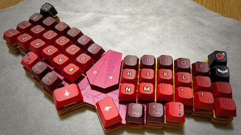
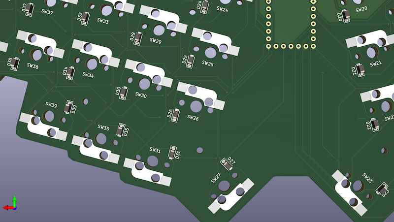
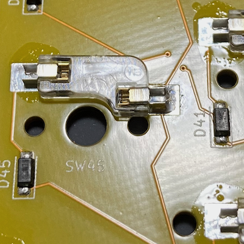
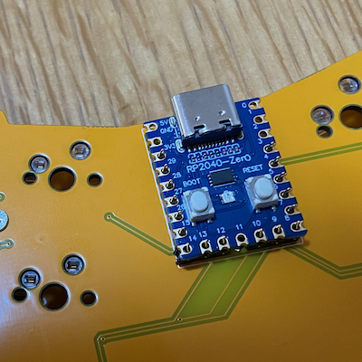

# ビルドガイド

Kewbie46 ビルドガイドです

## 必要なパーツ

|パーツ|数|説明|
|---|--|--|
|PCB|1|1.6mm 厚 [[gerber](../gerber/kewbie46/jlcpcb)]|
|トップレート|1|1.6mm 厚 [[gerber](../gerber/kewbie46/jlcpcb)]|
|ボトムプレート|1|1.6mm 厚 [[gerber](../gerber/kewbie46/jlcpcb)]|
|MCU カバー|1|[[gerber](../gerber/kewbie46/jlcpcb)]|
|RP2040-Zero|1|https://www.waveshare.com/wiki/RP2040-Zero|
|ダイオード|46|SMD style (SOD123/1N4148W)|
|キーソケット|46| Cherry MX Compatible|
|キースイッチ|46|Cherry MX Compatible|
|キーキャップ|46|Cherry MX Compatible|
|スペーサー M2 5mm|2|
|ボルト M2 3mm|4|
|ボルト M2 8mm|10|
|ナット M2|20|

## 組み立て

### ボトムプレート

### PCB

#### ダイオード

#### キーソケット

#### MCU

### PCB & ボトムプレート

### トップレート

