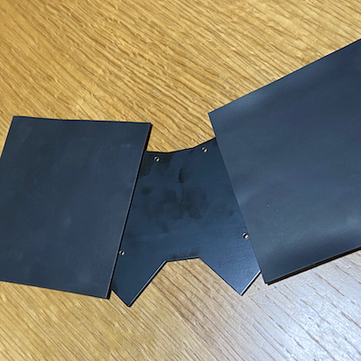
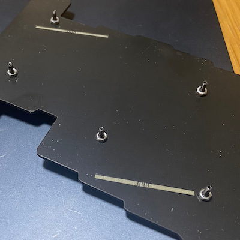

# Build Guide

This is the building guide for Kewbie46.

## Required Parts

|Name|Count|Remarks|
|---|--|--|
|PCB|1|1.6mm thick [[gerber](../gerber/kewbie46/jlcpcb)]|
|Top plate|1|1.6mm thick [[gerber](../gerber/kewbie46/jlcpcb)]|
|Buttom plate|1|1.6mm thick [[gerber](../gerber/kewbie46/jlcpcb)]|
|Cover Plate|1|[[gerber](../gerber/kewbie46/jlcpcb)]|
|RP2040-Zero|1|https://www.waveshare.com/wiki/RP2040-Zero|
|Diodes|46|SMD style (SOD123/1N4148W)|
|Key sockets|46| Cherry MX Compatible|
|Key swtiches|46|Cherry MX Compatible|
|Keycaps|46|Cherry MX Compatible|
|Spacers M2 5mm|2|
|bolt M2 3mm|4|
|bolt M2 8mm|10|
|Nut M2|20|

## Assembly

### Buttom Plate

### PCB

#### Diode

#### Key sockets

#### MCU

### PCB & Bottom

### Top Plate

